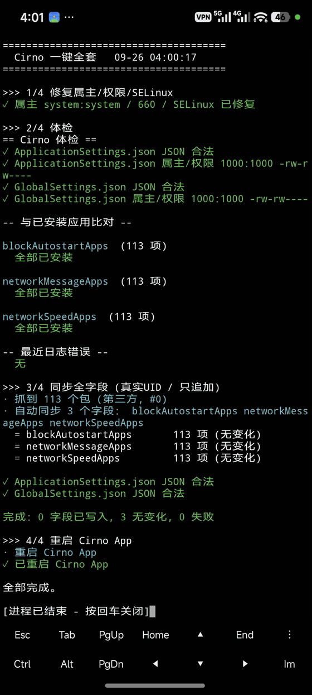
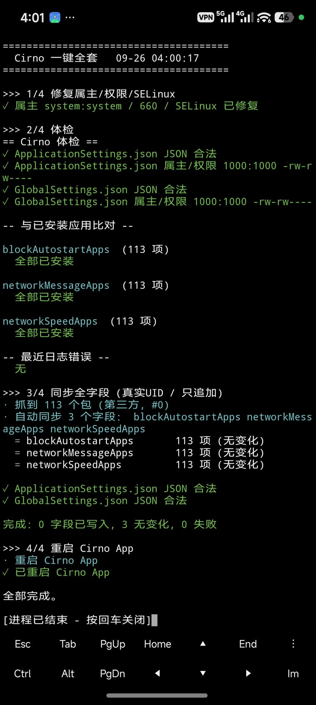
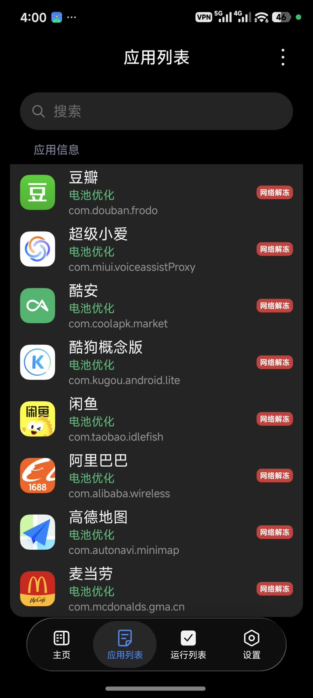
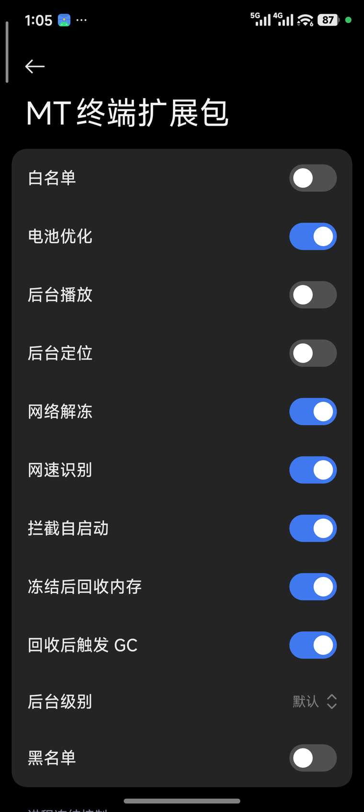

# Cirno 墓碑一键脚本

[English](README.md) | **中文**

[](LICENSE)
[](https://github.com/a2980162206/cirno-tombstone-oneclick/releases/latest)
[](https://github.com/a2980162206/cirno-tombstone-oneclick/releases)
[](https://github.com/a2980162206/cirno-tombstone-oneclick/stargazers)

Cirno 墓碑（后台冻结）一键配置脚本。自动采集已安装应用的包名并写入 Cirno 配置文件。**只要有 root 就能用** —— 不需要 Termux、不需要 Python、不需要 busybox，全程无需任何手动操作。



## 截图

| 一键运行 | 同步后的 Cirno 应用列表 | Cirno 开关 |
|---|---|---|
|  |  |  |

## 下载

- **最新（v1.0.2）** - [Release 页](https://github.com/a2980162206/cirno-tombstone-oneclick/releases/latest) | 直链 [`cirno.sh`](https://github.com/a2980162206/cirno-tombstone-oneclick/releases/download/v1.0.2/cirno.sh)
- 旧版本：[`v1.0.1`](https://github.com/a2980162206/cirno-tombstone-oneclick/releases/tag/v1.0.1)
- 仓库内：[`cirno.sh`](cirno.sh)（最新） | [`cirno-v1.0.1.sh`](cirno-v1.0.1.sh)（归档）

> **v1.0.2 更新** - 修复 Cirno App 读不到写入配置的 bug。三处包名列表写入的 printf 格式串尾部多了一个空格，每个包名都被写成带尾随空格的形式，Cirno 匹配不上，现已修正。

## 安装与运行

```sh
# 1. 把脚本推到手机
adb push cirno.sh /data/local/tmp/cirno.sh

# 2. 用 root 跑，就这一步
su -c "sh /data/local/tmp/cirno.sh"
```

跑起来后会自动扫描已装应用、修权限/属主/SELinux、校验 JSON、备份、写入、重载 Cirno，不用再手动做任何事。

```sh
sh cirno.sh          # 一键全套：修权限+体检+同步+重启
sh cirno.sh menu     # 交互菜单
sh cirno.sh help     # 全部命令
```

## 解决的三个坑

| 坑 | 表现 | 处理 |
|---|---|---|
| 权限/属主/SELinux 不对 | `Read Config 失败` | 写入后自动 `restorecon` + `660` + `1000:1000` 并自检 |
| 用 mv/rename 换文件 | 改了配置 App 没反应 | `cat >` 原地覆盖，保留 inode |
| 写真实 UID（`包名#10270`） | 界面开关不动 | 统一 `包名#0`，`normalize` 可一键转换 |

## 路径

| 变量 | 路径 |
|---|---|
| `APP` | `/data/system/Cirno/ApplicationSettings.json` |
| `GLB` | `/data/system/Cirno/GlobalSettings.json` |
| `BAK` | `/data/adb/cirno/backup` |
| `LOG` | `/data/system/Cirno/log/current.log` |

JSON 读写靠启动时写到 `/data/local/tmp/.cirno_j.awk` 的内置 awk 引擎，所以零依赖。

写入流程：校验 JSON -> 取日志基线 -> 备份 -> 记 inode -> `cat >` 覆盖 -> `restorecon`/`chmod`/`chown` -> 比对 inode -> 自检权限。非法 JSON 直接放弃，绝不产生半个文件。

## 命令

**同步**

```sh
sync                  # 列出所有 #uid 字段及数量
sync net              # 三个常用字段（覆盖）
sync merge            # 三个常用字段（只追加）
sync uid              # 同 merge
sync dry              # 预览
sync pick             # 交互选字段
sync <字段> [选项...]
```

选项：`--all` 含系统包 | `--merge` 只追加 | `--dry-run/-n` 预览 | `--no-reload` 写后不重启 | `--all-fields` 全字段 | `--bw` 带黑白名单 | `--uid` 真实UID（不推荐）

> `all`/`merge`/`uid`/`dry` 都隐含 `--auto`，默认只同步 `blockAutostartApps`、`networkMessageApps`、`networkSpeedApps` 三个字段。黑白名单默认跳过（人工点名语义），要同步加 `--bw`。

**浏览**

```sh
fields / get / bulksync / bulkclear
```

选择语法：`3` / `1 3 5` / `1,3,5` / `1-4` / `blackApps` / `黑名单` / `net`(模糊) / `a` / `q`

**编辑**

```sh
validate [app|global] | show [app|global] [字段] | keys [app|global]
add <字段> <包名...> | del <字段> <包名...>
set [app|global] <字段> <JSON值> | unset [app|global] <字段>
```

**维护**

```sh
doctor | diff [字段] | normalize | fix-perm | hotcheck [秒] | log [行数] | reload
backups | rollback [n]
```

每次写入前自动备份，保留最近 20 份。

## 运行要求

- 已 root 的 Android（Magisk / KernelSU）
- 已安装 Cirno
- `mksh` —— 脚本会自己 `exec /system/bin/sh`，**不要**用 bash 跑

## 常见问题

- **同步了没变化** -> 跑 `hotcheck`：无事件=inode 被换/进程不在；有事件但读取失败 -> `fix-perm`
- **开关点不动** -> 配置得是 `包名#0`，跑 `normalize`
- **没抓到包** -> 确认 root
- **数组全空** -> 别用 bash 跑，脚本必须走 mksh（会自动 `exec /system/bin/sh`）

## 关键词

Cirno 墓碑、后台冻结、免杀后台、省电、一键脚本、包名同步、root、Magisk、KernelSU、Android 后台管理

## 许可证

GNU GPL v3.0 —— 见 [LICENSE](LICENSE)。
